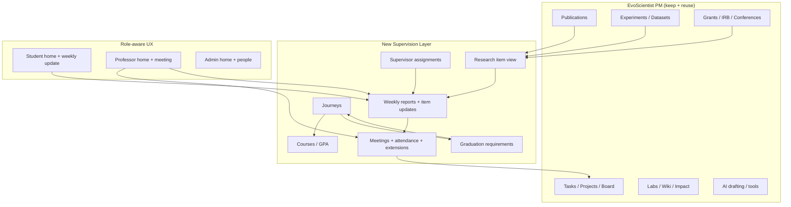

# Academic Supervision Integration Plan

**Goal:** Make EvoScientist easier for academicians and students by integrating the supervision and usability features from Research Progress Hub (RPH), while keeping EvoScientist's existing research operations, AI tools, and lab management strengths.

> **Scope update (applied): this platform is for academic publication work only.**
> Course, credit, GPA and transcript tracking was built and then removed — credits
> and grades belong in the registrar's system. Sections below that mention
> "Student Courses", "Courses / GPA" or credit/GPA requirement types are kept only
> as a record of the original proposal; do not implement them. What remains in
> scope from this plan is the supervision loop (assignments, weekly reports,
> meetings) and publication-based graduation requirements.
> See `plan/publication-and-ai-roadmap.md` for the current direction.

**Sources examined:**
- Local: `EvoScientist/pm/` (FastAPI + SQLite + React SPA)
- Friend's product: Research Progress Hub (RPH) — `http://versatile-teal-mule.77-245-159-4.cpanel.site`
  (roles verified: Administrator, Professor, Student)

---

## 1. Current State Summary

### EvoScientist PM — what already exists

| Area | Status |
|---|---|
| Research ops | Strong — projects, kanban tasks, experiments, datasets, publications, grants, conferences, IRB, patents |
| Lab management | Strong — labs, members, wiki, impact/citations (S2) |
| AI features | Strong — draft paper/grant, hypothesis, literature review, verify citations, figures |
| Platform roles | Weak — only `is_admin`; project `owner/editor/viewer`; lab labels `pi/postdoc/phd/ms/...` with no supervision semantics |
| Student–supervisor link | Missing — admissions has free-text `supervisor` only |
| Weekly reporting / meetings | Missing |
| Graduation / courses / journey | Missing |
| Role-aware UX | Weak — one nav for everyone; admissions UI orphaned; many routes hidden from nav |
| Home dashboard | Missing — default redirects to `/projects` |

### RPH — what it does well (the usability core)

| Module | What it gives academicians/students |
|---|---|
| **Weekly Update** (student) | Per-item structured updates (progress %, blocker, needs-help, what changed, next step) + short summary (accomplished / next focus / support needed), deadline before meeting, draft/submit states, history |
| **Weekly Meeting** (professor) | Week navigation, versioned meeting time, student checklist, attendance (On Time/Late/Excused/Absent + In Person/Online + note), "action for me" follow-ups, late-submission extensions |
| **Reports** | Filterable weekly submissions (status/review/risk/dates), CSV export, review panel (review status, risk override, feedback, create task) |
| **Research Items** | Unified pipeline for papers/patents/thesis/experiments/datasets/tools/grants/presentations with stages, progress, risk, deadlines, help flags |
| **Student Journeys** | Longitudinal BSc/MSc/PhD/Postdoc/IR tracks: programme, university, thesis title, start/end, active vs planned |
| **Student Courses** | Semesters + courses + GPA + credits, tied to journey |
| **Graduation Requirements** | Reusable level-based rules: Research Item counts, Course Credits, GPA, Milestone, Custom — with targets and required/optional |
| **Role-aware dashboards** | Admin (system ops), Professor (group workload, follow-ups, trends), Student (my workspace, next 30 days, graduation readiness) |
| **People / Branding / Email / Backup** | Org administration |

### Complementary strengths (do not copy — integrate)

EvoScientist already exceeds RPH on: publications pipeline, grants, IRB, conferences, experiments/datasets, S2 citation impact, AI drafting, MCP/skills, wiki, compute/sandboxes. RPH exceeds EvoScientist on: the **weekly supervision loop**, **journey/graduation**, **role-first UX**.

---

## 2. Gap Analysis — features to add

### P0 — Core supervision loop (highest usability impact)

1. **Professor ↔ Student relationship**
   - Platform roles: `admin`, `professor`, `student` (keep existing lab roles as secondary labels)
   - `supervisor_assignments` table (student_id, professor_id, active_from/to)
   - First student joins via invite/acceptance (extend `admissions` accept flow)

2. **Weekly Update (student submission)**
   - Per research-item update: progress %, status, blocker, needs_help, what_changed, next_step
   - Weekly summary: accomplished / next_focus / support_requested
   - States: `draft` → `submitted` → `reviewed` / `changes_requested` / `closed`
   - Deadline tied to professor's meeting time (versioned), Sunday fallback

3. **Weekly Meeting (professor workspace)**
   - Week picker + student checklist (to-check / completed)
   - Attendance: status, joined mode, note
   - "Action for me" → creates professor task (link to existing `tasks`)
   - Late-submission extension

4. **Reports + Review**
   - Filterable report table + CSV export (reuse `metrics_csv`/`exports`)
   - Review panel: review status, risk override (auto Low/Medium/High/Critical), feedback, create related task

### P1 — Academic journey & progress

5. **Student Journeys**
   - Levels: BSc / MSc / PhD / Postdoc / IR / Other
   - Fields: programme, university, department, start/end, thesis title, status (Planned/Active/Graduated)
   - One active journey per student; next journey can be Planned

6. **Graduation Requirements**
   - Templates per level: Research Item (by type + min stage), Course Credits, GPA, Milestone, Custom
   - Target value + unit + required/optional + archive (not hard delete)
   - Auto-compute readiness % from linked evidence (publications, courses, milestones)

7. **Student Courses**
   - Semesters → courses → credits, grade/GPA
   - Feed graduation credit/GPA checks

8. **Research Items as a supervision layer**
   - Map existing `publications`, `experiments`, `datasets`, `grants`, and new patent/presentation records into a unified "research item" view for weekly updates
   - Add fields RPH has that PM lacks: `progress_pct`, `risk_level`, `needs_help`, `next_deadline`, `blocker_type`

### P2 — Role-aware usability (academician/student ease of use)

9. **Role-aware navigation & home**
   - Student nav: Dashboard, Weekly Update, My Journey, My Courses, Projects, Tasks, My Library
   - Professor nav: Dashboard (group), Weekly Meeting, Reports, Journeys, Research, People, Management
   - Admin nav: system ops + people + branding + backup
   - Default home per role (not always `/projects`)

10. **Role dashboards**
    - Professor: submitted/needs-review/overdue KPIs, meeting follow-ups, weekly trend, attendance, workload-by-student, reports needing attention, active deadlines
    - Student: this-week status, my active research, tasks by deadline, next 30 days, research activity, graduation readiness, journey snapshot

11. **Fix existing UX debt (quick wins)**
    - Route and surface `AdmissionsPage` / `AdmissionDetail` (currently orphaned)
    - Expose hidden nav items (reports, analytics, conferences, IRB, profile)
    - Empty-state guidance per role (student onboarding, professor first-meeting setup)

12. **People & org admin (from RPH)**
    - Bulk CSV user import
    - Branding & logos (white-label lab identity)
    - Graduation requirement admin UI
    - Email settings status (RPH shows clear "email setup needs attention" banner)
    - Backup & import

---

## 3. Integration Architecture

### Data model additions (SQLite migrations in `pm/db.py`)

| Table | Purpose |
|---|---|
| `supervisor_assignments` | student ↔ professor link, active dates |
| `academic_journeys` | BSc/MSc/PhD/… tracks per student |
| `weekly_meeting_settings` | professor meeting day/time, versioned deadlines |
| `weekly_reports` | one per student per week |
| `weekly_report_items` | per research-item structured update |
| `meeting_attendance` | student, week, status, mode, note |
| `meeting_followups` | professor action items (or reuse `tasks` with source) |
| `report_extensions` | granted deadline extensions |
| `graduation_requirements` | level, type, target, required, active |
| `requirement_evidence` | link requirement ↔ publication/course/milestone |
| `student_courses` / `course_semesters` | academic record |
| `research_item_links` | unify pub/experiment/grant/patent as research items |

Roles: add `users.role` (`admin|professor|student`) or `user_roles` table; keep `is_admin` for platform admin.

### API additions (`pm/api/routes/`)

- `supervision.py` — assignments, journeys, requirements, courses
- `weekly_reports.py` — student submit, professor review, filters, CSV
- `meetings.py` — schedule, attendance, follow-ups, extensions
- Extend `dashboard.py` — role-specific stats endpoints
- Extend `users.py` — bulk import, role assignment

### Frontend additions (`pm/frontend/src/pages/`)

- `WeeklyUpdatePage.tsx` (student)
- `WeeklyMeetingPage.tsx` (professor)
- `ReportsPage.tsx` + `ReportReviewPage.tsx`
- `JourneyPage.tsx`, `CoursesPage.tsx`, `RequirementsPage.tsx`
- `ProfessorDashboard.tsx`, `StudentDashboard.tsx`
- Role-aware `NavBar.tsx` + home redirect per role
- Wire orphaned `AdmissionsPage` / `AdmissionDetail` into router

---

## 4. Phased Roadmap

### Phase 1 — Foundation (1–2 weeks)
- Platform roles (`admin|professor|student`) + supervisor assignment
- Role-aware nav + home redirect
- Admissions pages wired; nav completeness
- Weekly meeting settings schema

**Exit:** professor can claim students; student sees simplified nav.

### Phase 2 — Weekly supervision loop (2–3 weeks)
- Student Weekly Update (item updates + summary + draft/submit)
- Professor Weekly Meeting (checklist, attendance, follow-ups, extensions)
- Reports list + review panel + CSV
- Email/notifications for deadlines and "needs review"

**Exit:** full weekly cycle end-to-end for one student–professor pair.

### Phase 3 — Journey & publication readiness (2 weeks)
- ~~Journeys + courses + GPA~~ — courses/GPA removed from scope; degree context (level, programme, thesis title) stays
- Graduation requirements built on publication output + human-confirmed milestones
- Student "Graduation readiness" widget

**Exit:** student journey with readiness computed from real publication evidence.

### Phase 4 — Research items + polish (2 weeks)
- Unified research item view over publications/experiments/grants (+ patent/presentation)
- Professor/student analytics (trends, workload, portfolio by type)
- Branding, bulk people import, backup/import
- Onboarding empty states and help content for academics

**Exit:** RPH feature parity for supervision; EvoScientist still ahead on research ops + AI.

---

## 5. Usability Principles (from RPH)

1. **Role-first navigation** — students never see admin clutter; professors get supervision first.
2. **One weekly habit** — a single "Weekly update" action replaces scattered task/comment updates.
3. **Structured, not free-text-only** — progress %, risk, blockers, needs-help enable filtering and dashboards.
4. **Meeting as the deadline anchor** — submissions due before the meeting; versioned schedule changes.
5. **Evidence-linked graduation** — requirements auto-check from real publications/courses (fits EvoScientist's S2/publications strength).
6. **Safe archives** — remove archives requirements/journeys rather than deleting progress history.
7. **Clear empty states** — every list explains what to do next (RPH does this consistently).

---

## 6. Quick Wins (this week, low risk)

| # | Change | Why |
|---|---|---|
| 1 | Route `/admissions` in `main.tsx` | Dead code currently unreachable |
| 2 | Add missing nav links (reports, analytics, conferences, IRB, profile) | Discoverability |
| 3 | Add `users.role` + filter NavBar by role | Immediate academician/student clarity |
| 4 | Student-facing "My tasks due this week" panel on home | Reduce hunting |
| 5 | Professor-facing "students needing attention" list | Start of supervision UX |
| 6 | HelpPage: role-based getting-started (Student / Professor / Admin) | Onboarding |

---

## 7. Out of Scope (for now)

- Replacing EvoScientist publications/experiments with RPH's simpler research items — instead, create a supervision *view* over existing entities.
- Porting RPH branding/email/backup before the weekly loop works.
- Real-time chat (RPH Messages) — evaluate later; EvoScientist notifications may suffice.
- Course credits, GPA and transcript storage — removed from the product. The registrar owns the transcript; this platform covers publication work.

---

## 8. Success Metrics

- Time for a student to submit a weekly update &lt; 5 minutes
- Professor reviews all students in one meeting page (no navigation hunt)
- Graduation readiness accurate against published papers/courses already in the system
- Nav items unused by a role are hidden (cognitive load)
- Existing research ops workflows (publications, grants, experiments) unchanged and green in tests
