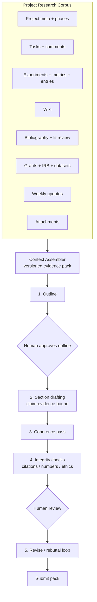

# Paper Module — Detailed Plan

**Problem statement (from product review):**
1. The Papers area is visually and operationally messy.
2. When a student/professor writes a paper, it must be grounded in **the whole project** — not a thin slice of it.
3. AI assistance must be **systematic**, not a bag of buttons.

This plan is written against the current `gazzali/` codebase (post-rename), after auditing
`drafting.py`, `drafting_helpers.py`, `PublicationsPage`, `PublicationDetail`, and
`PaperWorkspacePage`. Existing integrity/AI-usage work in `plan/publication-and-ai-roadmap.md`
is kept, not repeated.

---

## 1. Diagnosis — why Papers feels messy

### 1.1 Three overlapping surfaces

| Surface | Lines | What it does | Problem |
|---|---|---|---|
| `PublicationsPage` | 156 | List + create | OK — keep as list only |
| `PublicationDetail` | 663 | Edit metadata, versions, reviews, **AI composer (section/revise/rebuttal)**, experiment links, disclosure | Duplicates workspace; too many modes in one scroll |
| `PaperWorkspacePage` | 435 | Stage tools, readiness, evidence rail, draft history | Also has draft buttons; same AI actions |

A user cannot tell which page is "the" place to write. Buttons appear twice with different wording.

### 1.2 Context is thin

`_build_project_context` today includes only:
- project name + description
- task titles (`[status] title (priority)`)
- experiments: hypothesis, protocol, linked task titles, **verified metrics**, entries

**Not** in the prompt (yet in the project):

| Source | Route/CRUD | Why a paper needs it |
|---|---|---|
| Task **detail + comments** | `tasks`, `task_comments` | Decisions, design rationale |
| Project **phases** | `project_phases` | Timeline / contribution story |
| Lab **wiki** | `lab_wiki_pages` | Domain notes, methods conventions |
| **Bibliography** (BibTeX/RIS) | `bibliography.py` | Related work, citeable refs |
| **Literature review** runs | `literature_review.py` | Gap statement, positioning |
| **Grants** + funding | `grants` | Funding statement, scope |
| **IRB** approvals | `irb_approvals` | Ethics statement (already a readiness check) |
| **Datasets** | `datasets` | Data availability |
| **Attachments** | `attachments` | Protocols, figures, posters |
| Weekly report items | `weekly_report_items` | Progress narrative, open questions (partially wired via evidence pack) |
| Prior **publications** in project | `publications` | Avoid self-plagiarism; related drafts |

### 1.3 AI is a toolbox, not a pipeline

Today: "Draft introduction", "Draft results", "Revise", "Respond to reviewers" — each call is
independent. There is no:
- single **evidence pack** version that the writer and human both see
- **outline** step before prose
- **claim → evidence binding** (every number in Results must come from `experiment_metrics`)
- **coherence pass** across sections
- **human gate** between stages
- clear cost/length budget per stage

---

## 2. Target architecture



**Principle:** one context, one pipeline, one workspace. Every AI stage writes a
`publication_versions` row with provenance (already exists) and shows the user
*which evidence IDs* it used.

---

## 3. Workstream A — Project Research Corpus (context assembler)

### A1. `build_paper_context(project_id, publication_id | None, *, include=...) -> ContextPack`

Single module `gazzali/paper_context.py` used by all drafting endpoints.

**Sections, always labeled and ordered:**

1. **Project** — name, description, phase list
2. **Research questions / hypotheses** — from experiments + weekly summaries
3. **Tasks & decisions** — open/closed tasks + top comments (not just titles)
4. **Experimental evidence**
   - per experiment: hypothesis, protocol, metrics block, result entries
   - each block tagged `exp:{id}` for claim binding
5. **Prior literature** — bibliography entries (title, authors, year, venue); lit-review highlights if present
6. **Ethics & funding** — IRB number/status, grants (funder, title)
7. **Data & code** — dataset names + availability notes
8. **Narrative timeline** — weekly "what changed" bullets (last N weeks)
9. **Open questions** — needs-help items

**Contract:**
- Every fact carries a **source id** (`exp:…`, `metric:…`, `task:…`, `ref:…`)
- `ContextPack` is **persisted** (`paper_context_snapshots`) so drafts are reproducible
- Token budget: prioritize metrics > result entries > protocols > tasks > wiki; truncate prose only, never numeric results (already a rule — keep it)

### A2. Per-section views

| Section | Must include | May include |
|---|---|---|
| abstract | headline metrics, contributions | hypotheses |
| introduction | gap (lit review), objective, contributions | timeline |
| related work | bibliography + lit review | wiki notes |
| methods | protocols, datasets, IRB | task decisions |
| results | **only** linked experiments' metrics/entries | figures placeholders |
| discussion | results summary + open questions | prior work comparisons |
| conclusion | contributions + limitations | future work |

Section scoping (existing `publication_experiments.section`) remains: if links exist, Results/Methods use **only** linked experiments; Introduction may still see the full corpus.

---

## 4. Workstream B — Systematic AI writing pipeline

### Stage 0 — Setup (human)
- Create paper from **project** (or selected research items)
- Choose venue type, reporting guideline (STROBE/CONSORT/PRISMA/none)
- AI policy: e.g. "outline + sections + revision allowed; no invented citations"

### Stage 1 — Evidence pack (system)
- Assemble `ContextPack` (A1) → snapshot id shown in UI
- Human can toggle sources (include wiki? include weekly notes?)
- Shows coverage warnings ("0 metrics", "no bibliography", "IRB missing")

### Stage 2 — Outline (AI + human gate)
- Output: section list, 3–6 bullet claims per section, which `exp:`/`metric:` ids support each claim
- Human approves / edits outline → freezes "claim map" for later integrity checks

### Stage 3 — Section drafting (AI)
- One call per section using the **approved outline** + section-scope context
- Hard rules in prompt: only numbers from `metric:` ids; use `ref:` for citations; missing info → `[missing: …]`
- Writes `publication_versions` with `section`, `generated_by=ai-agent`, `prompt_hash`, **`evidence_ids`** (new column, JSON)

### Stage 4 — Coherence pass (AI)
- Input: all section texts + claim map
- Output: unified abstract + intro↔discussion consistency notes + list of contradictions
- Does **not** silently rewrite Results

### Stage 5 — Integrity checks (system, no LLM or cheap LLM)
| Check | Source |
|---|---|
| Every number in Results appears in a `metric:` row | regex vs metrics |
| Every citation key exists in bibliography | bibliography |
| Ethics statement ↔ approved IRB | irb_approvals |
| Funding statement ↔ grants | grants |
| AI disclosure counts vs versions | publication_versions |
| Required compliance fields non-empty | readiness gate (exists) |

Failures block "Submit pack", not drafting.

### Stage 6 — Human revision loop
- Revise with instructions (exists) — but must show **diff** vs previous version and which claims were affected
- Reviewer response (exists) — keep; add per-point tracking table (comment → action → section)

### Stage 7 — Submit pack
- Manuscript + BibTeX export (exists) + compliance statements + AI disclosure + evidence snapshot id

---

## 5. Workstream C — UI: one Paper Studio

Replace the dual `PublicationDetail` composer + `PaperWorkspacePage` sprawl with **one studio** and a thin list page.

### Layout (desktop-first, calm)

```
┌──────────────────────────────────────────────────────────────┐
│  Papers  /  Title…          [Writing]  readiness ● 82%       │
├──────────────────┬───────────────────────────┬───────────────┤
│ Pipeline         │  Manuscript editor        │ Evidence      │
│ 1 Setup          │  (section tabs)           │ - metrics     │
│ 2 Evidence ✓     │  [Intro][Methods][…]      │ - experiments │
│ 3 Outline        │                           │ - refs        │
│ 4 Draft sections │   AI actions for THIS     │ - weekly      │
│ 5 Coherence      │   section only:           │ - open Qs     │
│ 6 Integrity      │   [Draft] [Revise]        │               │
│ 7 Submit         │   [Regenerate]            │ Claim map     │
│                  │                           │ (outline)     │
└──────────────────┴───────────────────────────┴───────────────┘
```

### Rules
- **AI actions belong to the section you are looking at** — no global "AI composer" panel
- Pipeline steps are checklist navigation, not more buttons
- `PublicationDetail` becomes **Metadata & history** tab (title, venue, versions, reviews, disclosure)
- `PublicationsPage` stays list-only + "New paper from project"

### Stage-aware affordances
- Before outline: show "Generate outline" only
- After outline: show "Draft next section"
- Results tab: warn if no metrics linked
- Integrity step: green/red rows with jump links

---

## 6. Data model additions

```sql
paper_context_snapshots (
  id, project_id, publication_id, payload_json, created_by, created_at, label
);

publication_versions ADD COLUMN evidence_ids TEXT;  -- JSON array of source ids
publication_versions ADD COLUMN stage TEXT;          -- outline|section|coherence|revision|rebuttal

paper_claim_map (
  id, publication_id, section, claim_text, evidence_ids, status, created_at
);

paper_integrity_runs (
  id, publication_id, snapshot_id, checks_json, passed, created_at
);

paper_review_points (   -- reviewer comment tracking
  id, publication_id, round, comment, action, section, status
);
```

---

## 7. API sketch

```
POST /projects/{id}/papers                    # create paper from project
GET  /papers/{id}/context                     # current ContextPack summary
POST /papers/{id}/context/snapshot            # freeze pack
POST /papers/{id}/outline                     # AI outline → claim map
PUT  /papers/{id}/outline                     # human edits
POST /papers/{id}/sections/{section}/draft    # Stage 3 (uses snapshot + claim map)
POST /papers/{id}/coherence                   # Stage 4
POST /papers/{id}/integrity                   # Stage 5
GET  /papers/{id}/pipeline                    # stage status for UI
```

Reuse existing: revise, reviewer response, readiness, evidence, bibliography export, AI usage.

---

## 8. Phases

### Phase P1 — Context assembler (foundation)
- `paper_context.py` + snapshot table + `GET /papers/{id}/context`
- Wire **all** sources in §1.2 into one pack
- UI: Evidence panel lists what is in the pack (with include toggles)

### Phase P2 — Pipeline core
- Outline + claim map + section draft with `evidence_ids`
- Integrity checks (numbers, citations, ethics, funding)
- Pipeline status endpoint

### Phase P3 — UI consolidation
- Paper Studio (single workspace)
- Demote `PublicationDetail` to metadata/history
- Remove duplicate AI composer

### Phase P4 — Review & submit
- Reviewer point tracking
- Submit pack export (manuscript + bibtex + disclosure + snapshot)
- Token budget per stage in AI usage panel

---

## 9. Non-goals
- Full LaTeX/Word rendering (export text + BibTeX first)
- Replacing the ARC/experiment pipeline
- Course/GPA features (already removed by product decision)
- Auto-rewriting Results from the model without metrics

---

## 10. Success criteria
1. Creating a paper from a project produces an Evidence pack that shows **every** source type present (or an explicit "not present").
2. A Results section cannot be drafted when zero metrics exist for linked experiments.
3. Every AI version records `evidence_ids` + `prompt_hash` + stage.
4. A user writes a paper in **one** screen; the only AI controls apply to the current section/stage.
5. Integrity run blocks submit on missing citation keys or unverified numbers.

---

## 11. Suggested first slice (1–2 days)
Implement **P1 + outline gate**: full context pack, visible in UI, outline generation with claim map.
That alone fixes "papers don't use the project" and starts the systematic path.
